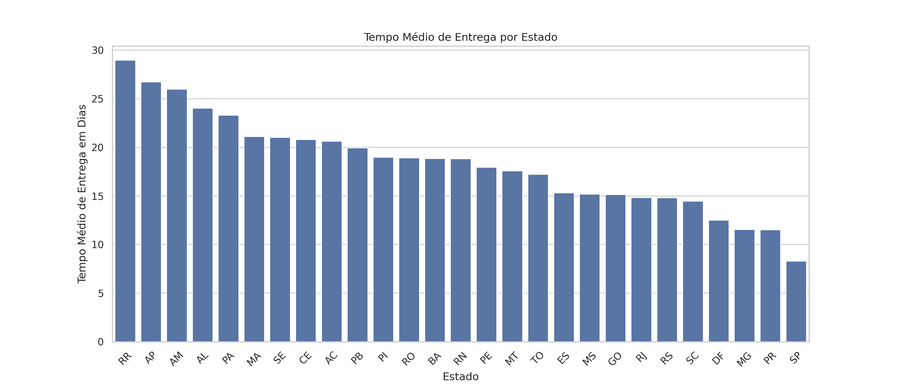

# 📊 E-commerce & Logistics Operational Analysis — Olist

## 🎯 Project Objectives

This project aims to analyze operational data from a Brazilian marketplace using the Olist public dataset. The analysis addresses key logistical bottlenecks and patterns to support data-driven business decisions.

## 🛠️ Technologies & Tools

- **Python** (Pandas, NumPy, Matplotlib, Seaborn, SciPy)
- **Google Colab**

## 📈 Key Analyses & Insights

### 1. Peak Ordering Hours
We identified the times of day with the highest volume of purchases to optimize customer support and campaign planning.

* **Business Insight:** There is a clear concentration of orders between **10 AM and 10 PM**. It is recommended to reinforce operational capacity and customer support during this window.

---

### 2. Average Delivery Time by State
Analysis of the time it takes for orders to reach customers in each Brazilian state, compared to the national average.

* **Business Insight:** States in the Northern region (such as RR, AP, and AM) show delivery times significantly higher than the national average. It is necessary to re-evaluate local logistics partnerships.

---

## 🔮 Next Steps
- Build predictive models to estimate delivery times and anticipate delays.
- Analyze the relationship between freight cost and the distance between seller and customer.

## ✍️ Author & Contact
Developed by **Renata Alves**. If you have any questions, suggestions, or would like to discuss this project, feel free to reach out:

