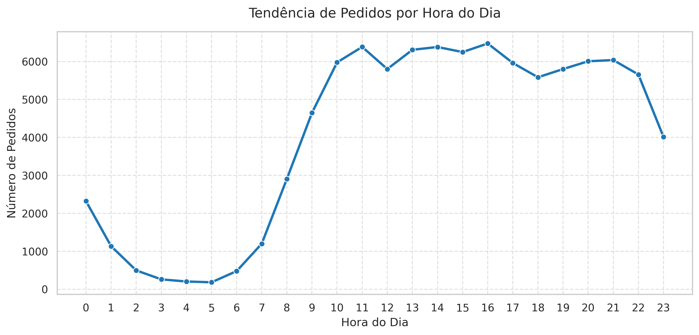

# 📊 Análise Operacional de Pedidos e Entregas — Olist

## 🎯 Objetivo

Este projeto tem como objetivo analisar dados operacionais de um marketplace brasileiro utilizando o dataset público da Olist. A análise aborda os principais gargalos e padrões logísticos para embasar decisões de negócios.

## 🛠️ Ferramentas Utilizadas

- **Python** (Pandas, NumPy, Matplotlib, Seaborn, SciPy)
- **Google Colab**

## 📈 Principais Análises e Insights

### 1. Horários de Pico de Pedidos
Identificamos os momentos do dia com maior volume de compras para otimização do atendimento e planejamento de campanhas.

* **Insight:** Há uma clara concentração de pedidos entre **10h e 22h**. Recomenda-se reforçar a capacidade operacional e suporte ao cliente nesse intervalo.

---

### 2. Tempo Médio de Entrega por Estado
Análise do tempo que os pedidos levam para chegar aos clientes em cada estado brasileiro, comparados à média nacional.

* **Insight:** Estados da Região Norte (como RR, AP e AM) apresentam prazos de entrega significativamente superiores à média nacional. É necessário reavaliar os parceiros logísticos locais.

---

## 🔮 Próximos Passos
- Implementar modelos preditivos para estimar prazos de entrega e antecipar atrasos.
- Realizar análise da relação entre frete pago e a distância vendedor-cliente.

## ✍️ Autoria e Contato

Desenvolvido por **Renata Alves**. Se você tiver alguma dúvida, sugestão ou quiser conversar sobre este projeto, sinta-se à vontade para entrar em contato:

